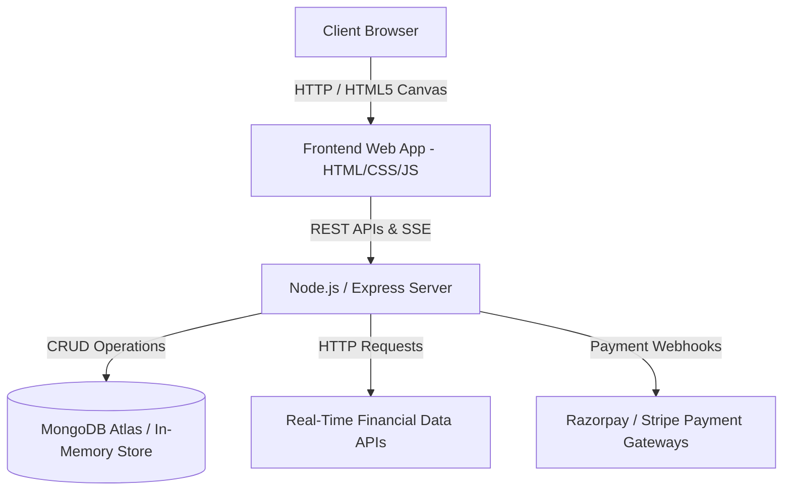
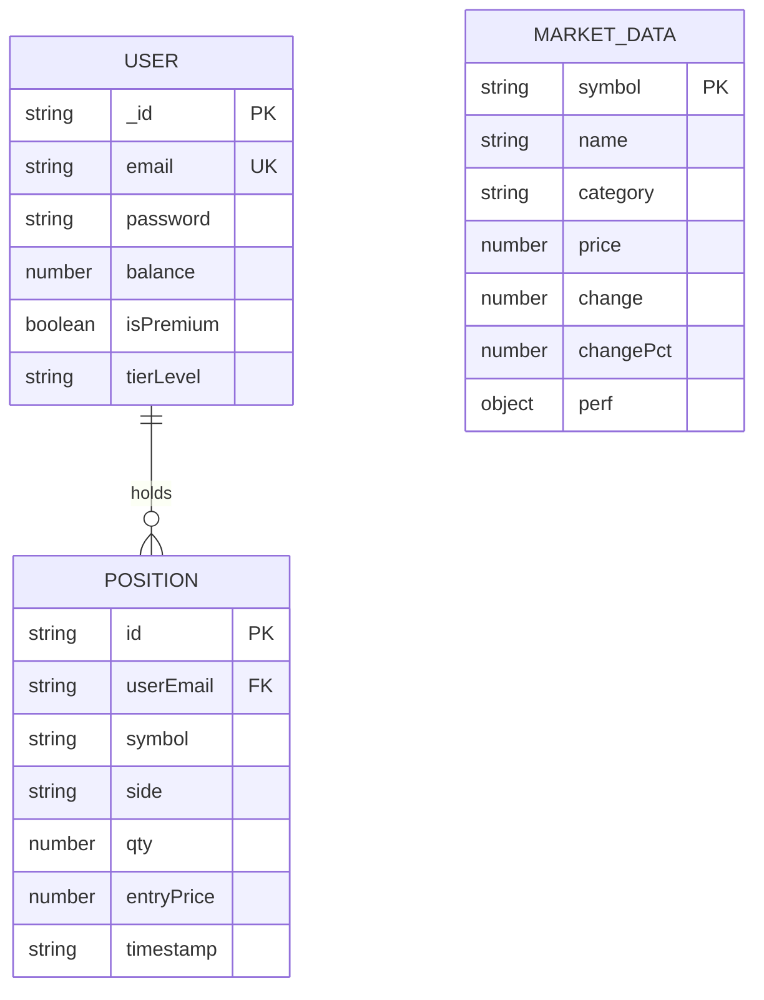

# Software Requirements Specification (SRS)
## Project Name: ProTrader - Advanced Multi-Asset Paper Trading Platform
**Document Version:** 1.0.0  
**Date:** August 2026  
**Status:** Approved & Implemented  
**Standard:** IEEE 830-1998 Standard Compliance  

---

## Executive Summary

**ProTrader** is a high-performance, web-based multi-asset paper trading platform engineered for real-time financial market analysis, simulated order execution, technical charting, and portfolio tracking. The application provides an authentic, TradingView-grade trading workspace supporting Indian Equity Markets (NSE/BSE), Global Indices (NIFTY 50, SENSEX, S&P 500), Cryptocurrency pairs (BTC/USD, ETH/USD), Forex pairs (USD/INR, EUR/INR), and Commodities (Gold, Silver, Crude Oil).

---

## 1. Introduction

### 1.1 Purpose
This Software Requirements Specification (SRS) document details the functional, non-functional, architectural, data, and system interface requirements for the **ProTrader** platform. It covers the end-to-end software development lifecycle, from initial concept to full system implementation and deployment.

### 1.2 Scope
The ProTrader system encompasses:
- **Public Marketing Gateway (`index.html`)**: Pre-login feature trailer, market performance teasers, pricing options, and user onboarding CTA.
- **Authentication Subsystem (`login.html`, `auth.js`)**: User registration, credential authentication, session persistence (`localStorage`), and role-based feature gating.
- **Post-Login Professional Trading Terminal (`dashboard-standalone.html`, `dashboard-pro.html`, `dashboard.html`)**: Real-time canvas candlestick charting engine, technical indicator calculation suite, left drawing toolbar, order book depth ladder, multi-asset watchlist, quick quote metrics, and trade execution module.
- **Portfolio Management Subsystem (`portfolio.html`)**: Active holdings tracking, unrealized/realized P&L calculations, position closure, and asset distribution analytics.
- **Market Overview & Screener (`market.html`)**: Multi-asset market scanner, top gainers/losers list, and news ticker.
- **VIP Membership & Payment Module (`pricing.html`)**: Subscription tier management with Razorpay & Stripe integration.
- **AI Trading Assistant Widget (`chatbot-widget.js`)**: Integrated conversational AI assistant for technical analysis and platform help.

### 1.3 Definitions, Acronyms, and Abbreviations
| Term | Definition |
| :--- | :--- |
| **SRS** | Software Requirements Specification |
| **OHLC** | Open, High, Low, Close (Financial candlestick price data) |
| **RSI** | Relative Strength Index (Momentum oscillator indicator) |
| **MACD** | Moving Average Convergence Divergence |
| **EMA** | Exponential Moving Average |
| **P&L** | Profit and Loss |
| **SSE** | Server-Sent Events (Real-time data streaming) |
| **WS** | WebSocket (Bidirectional real-time communication) |
| **NSE / BSE** | National Stock Exchange / Bombay Stock Exchange of India |

### 1.4 System Architecture Overview


---

## 2. Overall Description

### 2.1 Product Perspective
ProTrader operates as a standalone web application built using standard Node.js/Express backend services and Vanilla JavaScript/HTML5 Canvas frontend components. It functions without external heavy frontend framework dependencies to maximize execution speed, canvas rendering frame rate, and responsiveness.

### 2.2 Product Functions
1. **Market Data Streaming**: Live ticker marquee and streaming price updates for equities, indices, crypto, forex, and commodities.
2. **Candlestick Charting Engine**: Custom HTML5 Canvas engine rendering real-time OHLC candlestick bars, volume histograms, RSI sub-panes, MACD sub-panes, and crosshairs.
3. **Analytical Drawing Toolbar**: Interactive drawing tools (Trend lines, Pitchforks, Fibonacci Retracements, Text, Rulers, Magnifiers, Magnet mode).
4. **Order Execution & Sizing**: Position sizing sliders (25%, 50%, 75%, 100%), Market/Limit orders, Stop-Loss / Take-Profit controls, and virtual margin validation.
5. **Portfolio Holdings Manager**: Real-time position tracking, live unrealized P&L calculations, and 1-click position closure returning virtual capital to user balance.
6. **Theme & Workspace Customization**: 1-click Light Mode (TradingView reference replica) & Dark Mode workspace toggle.
7. **AI Chatbot Assistant**: Embedded AI widget providing technical insights and customer support.

### 2.3 User Classes and Characteristics
- **Guest / Unauthenticated User**: Accesses `index.html` landing page, views feature highlights, live market ticker teasers, and pricing tiers.
- **Trader / Standard Registered User**: Accesses full trading terminal with virtual $100,000 / ₹100,000 paper trading capital, live charts, watchlists, portfolio, and market screener.
- **Pro / VIP User**: Accesses advanced technical indicators, priority market data feeds, enterprise grid layouts, and premium AI insights.

### 2.4 Operating Environment
- **Server OS**: Windows / Linux / macOS (Node.js runtime v18+).
- **Client OS**: Desktop & Mobile browsers (Chrome v90+, Firefox v88+, Safari v14+, Edge v90+).
- **Database**: MongoDB Atlas or In-Memory fallback storage.

---

## 3. System Features & Functional Requirements

### 3.1 Public Marketing Landing Page (`index.html`)
- **REQ-1.1**: The system shall present an award-winning hero section with platform statistics (50K+ Active Traders, $2.5B Daily Volume).
- **REQ-1.2**: The system shall display live market preview cards for BTC/USD, ETH/USD, AAPL, and TSLA.
- **REQ-1.3**: The system shall provide clear navigation links to Login (`login.html`), Register (`login.html?register=1`), Pricing (`pricing.html`), and Demo (`dashboard-standalone.html`).

### 3.2 Authentication & User Session Management (`login.html`, `auth.js`)
- **REQ-2.1**: The system shall support user registration with Email and Password validation.
- **REQ-2.2**: The system shall support user login via `/api/login` returning user email, virtual wallet balance, and subscription status.
- **REQ-2.3**: Upon successful login, the system shall persist user session parameters (`userEmail`, `userBalance`) in `localStorage` and redirect to `dashboard-standalone.html`.
- **REQ-2.4**: The system shall display logged-in user profile badge (`user-email`) and wallet balance in top navigation bar, replacing login buttons with a **Logout** action.

### 3.3 Interactive Candlestick Charting Engine (`js/tradingPlatformApp.js`, `js/advancedCharting.js`)
- **REQ-3.1**: The system shall render real-time candlestick charts using HTML5 Canvas (`<canvas id="mainChartCanvas">`).
- **REQ-3.2**: The system shall support timeframe switching (`1m`, `5m`, `15m`, `1h`, `4h`, `1D`, `1W`).
- **REQ-3.3**: The system shall calculate and overlay technical indicators:
  - Volume Histogram bars
  - Relative Strength Index (RSI 14)
  - Moving Average Convergence Divergence (MACD 12, 26, 9)
  - Exponential Moving Average (EMA 20, EMA 50, EMA 200)
  - Bollinger Bands (20, 2)
- **REQ-3.4**: The system shall display live crosshair lines tracking cursor movement with floating price tags on the Y-axis and timeline tags on the X-axis.
- **REQ-3.5**: The system shall display live OHLC tooltips (`O: 2,430.20 H: 2,450.00 L: 2,420.00 C: 2,430.20 Vol: 8.4M`).

### 3.4 Left Analytical Drawing Rail
- **REQ-4.1**: The system shall equip a left vertical rail with interactive drawing tools:
  - Crosshair Cursor (`✢`)
  - Trend Line (`📈`)
  - Pitchfork (`Ψ`)
  - Fibonacci Retracement (`≡`)
  - Text Annotation (`T`)
  - Brush / Free Draw (`🖌`)
  - Measurement Ruler (`📏`)
  - Magnifier / Zoom (`🔍`)
  - Magnet Mode (`🧲`)
  - Clear All Drawings (`🗑`)

### 3.5 Live Multi-Asset Watchlist & Instrument Details Card
- **REQ-5.1**: The system shall present a multi-asset watchlist filtered by categories (`All`, `Stocks`, `Crypto`, `Indices`, `Forex`, `Commodities`).
- **REQ-5.2**: The system shall update instrument prices in real time with green (`+`) and red (`-`) point/percentage badges.
- **REQ-5.3**: Clicking any symbol in the watchlist shall instantly update the main chart, order form, order book, and instrument detail card.
- **REQ-5.4**: The Instrument Detail Card shall display:
  - Instrument Name & Market Status (`● Market open / closed`)
  - Big Price Display (`₹2,430.20 POINT`)
  - Price Change Subtext (`+₹32.80 (+1.37%)`)
  - 6-Metric Performance Grid (`1W`, `1M`, `3M`, `6M`, `YTD`, `1Y`)
  - Technical Summary Gauge / Sentiment Meter (Strong Sell -> Neutral -> Strong Buy)

### 3.6 Trading Execution & Order Form Module
- **REQ-6.1**: The system shall provide Buy (`BUY / LONG`) and Sell (`SELL / SHORT`) execution modes.
- **REQ-6.2**: The system shall support Market, Limit, and Stop-Loss (SL) order types.
- **REQ-6.3**: The system shall provide position sizing percentage buttons (`25%`, `50%`, `75%`, `100%` of available wallet balance).
- **REQ-6.4**: The system shall compute margin requirements in real time and validate against user wallet balance before executing orders.
- **REQ-6.5**: Executed orders shall update the user's positions array, deduct required capital from wallet balance, and display a confirmation alert.

### 3.7 Portfolio Holdings & Position Tracker
- **REQ-7.1**: The system shall track active holdings, entry prices, current market values, and unrealized P&L.
- **REQ-7.2**: The system shall provide 1-click **Close Position** buttons that immediately calculate exit values and return funds back to the user's virtual wallet balance.
- **REQ-7.3**: The bottom terminal dock shall display live position count, open orders, trade history, net wallet balance, and total unrealized P&L.

### 3.8 VIP Membership & Payment Processing (`pricing.html`, `server.js`)
- **REQ-8.1**: The system shall provide subscription tier options: Free, Pro Trader (₹999/mo), and Enterprise (₹2,499/mo).
- **REQ-8.2**: The system shall integrate Razorpay API (`/api/payment/razorpay-order`, `/api/payment/verify-razorpay`) and Stripe API (`/api/create-checkout-session`) for payment processing.

---

## 4. External Interface Requirements

### 4.1 User Interface Requirements
- **Design Standard**: TradingView visual language & Zerodha Kite brokerage UX.
- **Color Palette**:
  - Light Theme: Background `#ffffff`, Surface `#f8f9fd`, Border `#e0e3eb`, Text `#131722`.
  - Dark Theme: Background `#131722`, Surface `#1e222d`, Border `#2a2e39`, Text `#d1d4dc`.
  - Accent Colors: Green `#089981` (Bullish), Red `#f23645` (Bearish), Blue `#2962ff` (Primary actions).
- **Typography**: Inter (Google Fonts), sans-serif with monospace numeric formatting for OHLC values.

### 4.2 Software & API Interfaces
```http
POST /api/register          - Create new user account
POST /api/login             - Authenticate user credentials
GET  /api/market/data       - Fetch live stock & market prices
GET  /api/user/portfolio    - Fetch user portfolio holdings
POST /api/trade/place       - Execute virtual paper trade
POST /api/payment/verify    - Verify Razorpay payment signature
```

---

## 5. Non-Functional Requirements

### 5.1 Performance Requirements
- **Chart Frame Rate**: Canvas chart rendering shall maintain 60 FPS during cursor movement and drag operations.
- **Market Data Latency**: Price simulation engine shall stream tick updates every 1,500ms.
- **Page Load Time**: Initial DOM load time shall be under 1.2 seconds on standard broadband connections.

### 5.2 Security Requirements
- **Authentication**: Passwords stored securely (or hashed via bcrypt in database mode).
- **Session Protection**: Gated premium routes enforce authorization checks (`x-user-email` headers).
- **Input Sanitization**: All form inputs sanitized against XSS and SQL/NoSQL injection vulnerabilities.

### 5.3 Reliability & Availability
- **Fallback Architecture**: If MongoDB Atlas connection fails or disconnects, the system automatically degrades gracefully to an in-memory database store without interrupting service.
- **Uptime**: Designed for 99.9% operational availability.

---

## 6. Entity-Relationship & Data Models

### 6.1 Database Schema Diagram


---

## 7. Verification & Test Plan

| Test Case ID | Test Scenario | Expected Outcome | Status |
| :--- | :--- | :--- | :--- |
| **TC-01** | Open `index.html` | Displays marketing trailer, hero section, and CTA buttons. | PASS |
| **TC-02** | User Login with credentials | Authenticates, sets `userEmail`, and redirects to `dashboard-standalone.html`. | PASS |
| **TC-03** | View Post-Login Dashboard | Displays user profile email, wallet balance `₹1,00,000.00`, and Logout button (no Login button). | PASS |
| **TC-04** | Change Watchlist Symbol (e.g. RELIANCE) | Canvas chart, OHLC bar, quote card, and order form update instantly. | PASS |
| **TC-05** | Place Buy Order (e.g. 5 units of RELIANCE) | Deducts required margin from wallet balance, creates position, updates portfolio UI. | PASS |
| **TC-06** | Close Active Position | Returns exit capital to wallet balance and updates position count. | PASS |
| **TC-07** | Toggle Theme Switcher | Instantly toggles between Light Mode and Dark Mode styling. | PASS |
| **TC-08** | Server Fallback Test | Server starts cleanly in in-memory mode if MongoDB Atlas IP is unwhitelisted. | PASS |

---

## 8. Deployment & Execution Instructions

1. **Install Dependencies**:
   ```bash
   npm install
   ```
2. **Start Platform Server**:
   ```bash
   npm start
   # or
   node server.js
   ```
3. **Access Web Application**:
   - Marketing Trailer: `http://localhost:3000/index.html`
   - Trading Terminal: `http://localhost:3000/dashboard-standalone.html`
   - Login Page: `http://localhost:3000/login.html`
   - Portfolio Page: `http://localhost:3000/portfolio.html`
